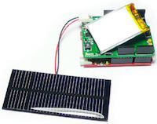
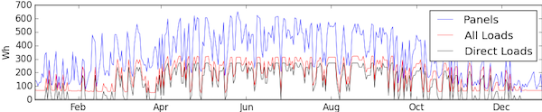
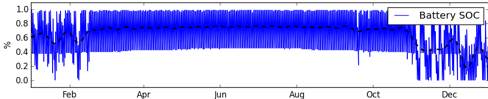
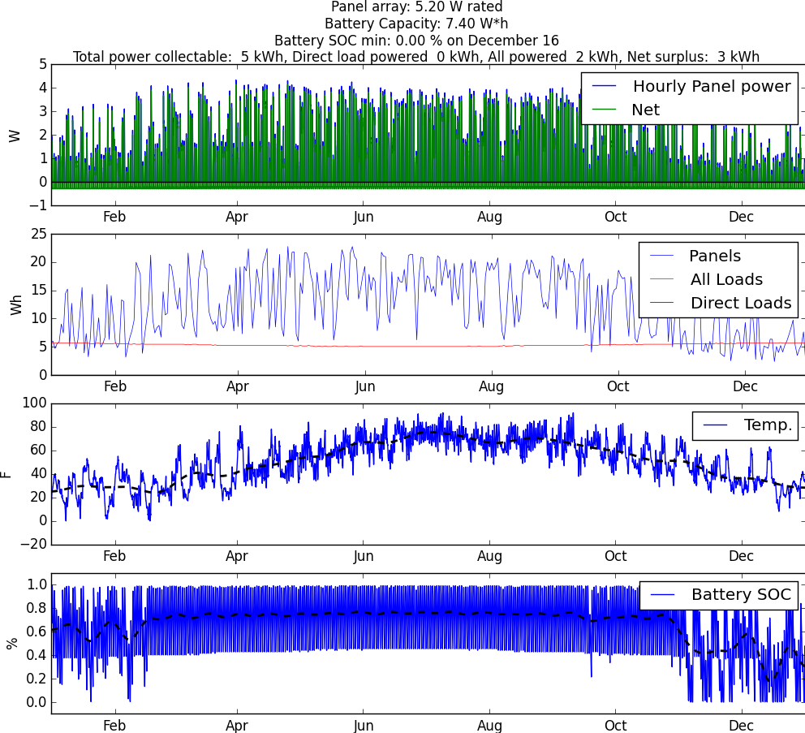
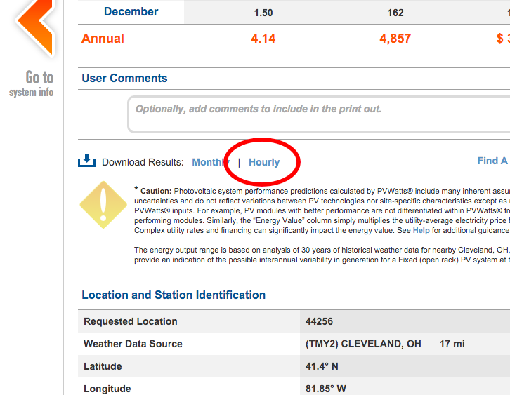
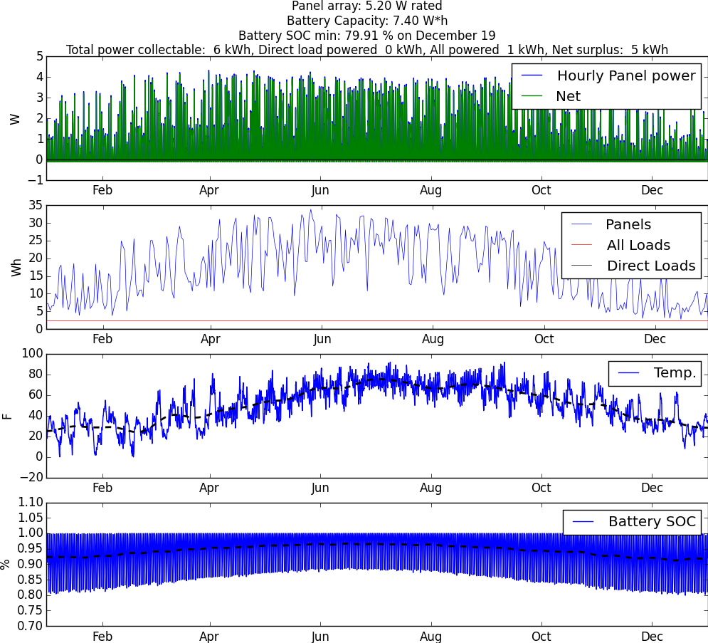
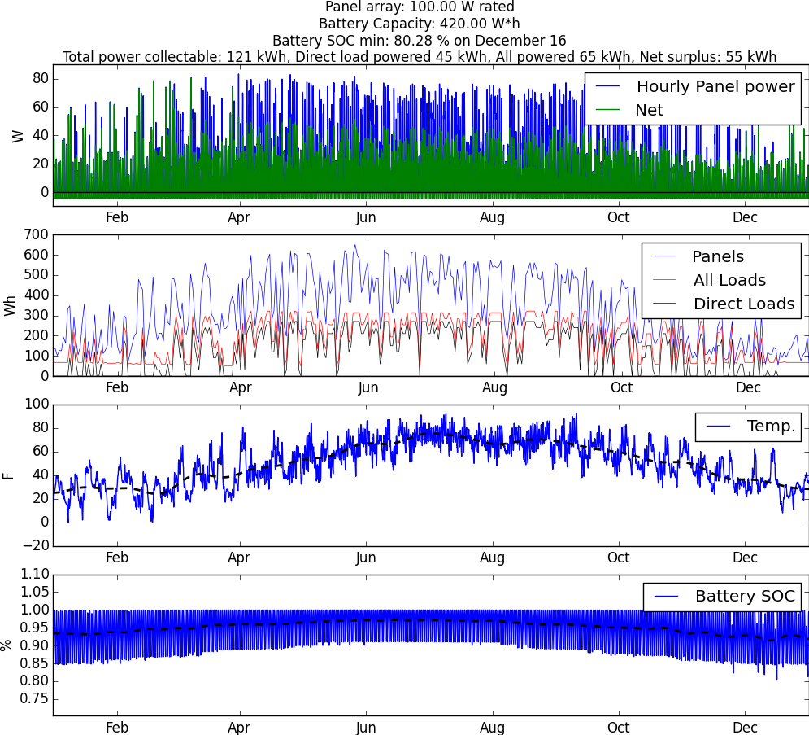
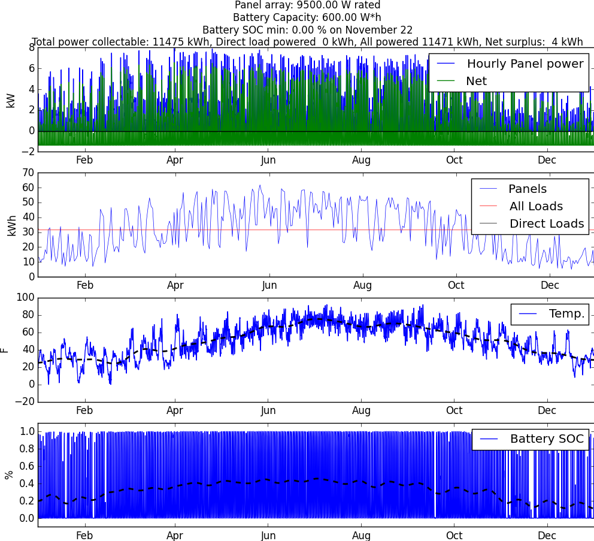
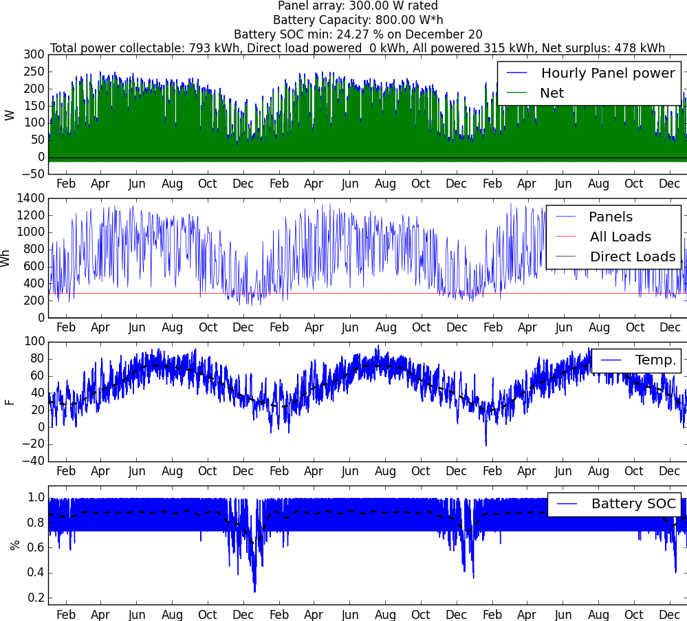

[](https://travis-ci.org/thearn/solar_energy_calculator)
Solar energy budget calculator
===============================

<center>
	
	<br>
	
	<br>
	
</center>

[Jump down to examples](#examples) 

--------

This is a python code that implements a simple power budget model for the sizing and
analysis of ground-based photo-voltaic energy systems, included battery storage. I've written it primary with small-power hobby or residential applications in mind.

The core of this code is a model which implements a transient power balance
calculation, culminating in a time integration of a battery bank state-of-charge over time. This allows a user to very easily size a solar panel array and battery bank together for their intended application. It's a reasonably low fidelity model, and only takes a few seconds to run.

This model was written using NASA's OpenMDAO framework, and makes use of data from
the U.S. Department of Energy's National Renewable Energy Laboratory (NREL).

The core components of the model are contained in `solar.py`. The file `basic.py` includes an example
model of powered loads and overall problem specification. This is used to 
make the end-user command line interface problem, `run.py`. A more complex example is shown in `greenhouse.py`.

This is very much a work-in-progress. I am not an electrical engineer by training, but I do multidisciplinary systems analysis and optimization. It's my goal for the model to be sufficient for the design of real-world low power systems (see below for a list of projects that I have in mind).

Requirements
---------------
- Python 2.7/3.4 or higher
- Numpy, scipy, and matplotlib. It's probably best to use a system package manager or a distribution like [Anaconda](https://www.continuum.io/downloads) to set these up
- [OpenMDAO 1.0](http://openmdao.org/) or greater: `pip install openmdao` or clone and install from Github
- A small test file can be run to verify that everything is set up: `cd lib; python test_run.py`

Summary of end-user application, `run.py`
---------------------
This application is a command-line interface to the simple model in `basic.py`. It produces a visualization of the performance of a photovoltaic 
energy collection and storage system over the course of one year of operation on an hour-by-hour basis, based on a variety of parameters:

 - Geographic location
 - PV array size (in rated watts)
 - Battery bank size (in watt-hours)
 - Power usage (load) specification (constant, daytime, night time, or direct PV load)

Using location-based data, the time series model then simulates one-year of 
operation of the described system, on an hour-by-hour basis. 

Below is an example
of the figure produced for a 100w panel + 360 Watt-hour battery system powering a constant 5 Watt load (lights or sensors, etc.):

<div style="text-align:center">
	
</div>

This transient analysis is what differentiates this code from other solar energy calculators. [Full examples](#examples) with design considerations, descriptions of the plot information, and output interpretation are further below.

Limitations and assumptions:
------------
- The array is assumed to be static (non-tracking) and pointed and tilted based on the values given in the [downloaded NREL data](#nrel_data). An active-tracing or manual re-tilted array can be expected to extract more energy over time.
- The model is entirely based in simple power balancing. Losses due DC-DC conversion, transmission loss or power inversion are modeled with an efficiency coefficient on the panel side, and not currently modeled between the battery and the loads. For now, DC-DC losses between the battery and the load should be taken account by increasing the load power specifications.
- Related: a full battery charge/discharge curve isn't simulated in the state-of-charge integration. The SOC calculation does not take into account charge/discharge rate limitations or dynamics based on a specific battery chemistry.
- The state of charge computed is NOT a percent of a nominal amp-hour rating (the usual definition of SOC), but of the user-set watt-hour value. 
- In a real-world setting, your effective solar line-of-sight may be limited due to objects on the horizon (trees, other structures, etc.) The NREL data, to my best understanding, is based on an assumption of unobstructed line-of-sight, which may not be the case especially at the very beginning and very end of the day where solar illumination is transitioning. However, I have included options for hard cut-off times to be set to model a real-world situation (see examples below).

Usage and examples
====================

To use the user application, run `python run.py` with the following options:

```
Usage: run.py [OPTIONS]

  Solar calculation application

Options:
  -data TEXT                   NREL Data file(s) for your location. Separate
                               file names by comma.
  -o TEXT                      Output figure file name (png format)
  --efficiency FLOAT           Power conversion efficiency
  --panel_watt FLOAT           Total rated panel power for your system (Watt)
  --battery_capacity FLOAT     Total battery power capacity for your system
                               (Watt-hr)
  --power_use_constant FLOAT   Constant background power load (Watt)
  --power_use_daytime FLOAT    Daytime power load (Watt). This is added on top
                               of the background power use, during daylight
                               hours.
  --power_use_nighttime FLOAT  Nighttime power load (Watt). This is added on
                               top of the background power use, during night
                               time hours.
  --power_use_direct FLOAT     Direct load (Watt). This is load that will be
                               applied only when the available PV power can
                               match it (i.e.. during the day in direct
                               sunlight)
  --direct_min_temp FLOAT      Direct load min temperature (Deg. F). The
                               direct load value will only be applied if the
                               ambient temperature is above this optional
                               level. Useful for direct solar water pumps,
                               etc.
  --start_time FLOAT           Start time cut-off (hour 0-23). Collected PV
                               power before this hour is set to zero. Used to
                               model obstruction at dawn.
  --end_time FLOAT             End time cut-off (hour 0-23). Collected PV
                               power after this hour is set to zero. Used to
                               model obstruction at dusk
  --help                       Show this message and exit.
```
This produces the figure like the one shown in the previous section.
If you don't specify a particular variable, you will be prompted to enter one. Press
enter to accept the shown default value.

Getting NREL data<a name="nrel_data"></a>
---------------------

Th NREL data may be collected by running their [PVWATTS calculator application](http://pvwatts.nrel.gov/).

- You'll be asked to first specify your location (by address, zip code, or other)
- Then in the following screens you will be asked to specify parameters for a residential PV system. You can just take all of the defaults for this
- Then click through to the last screen. On the last screen, scroll down and click the "Download Hourly Results" file, a CSV file with hourly climate and solar illumination and PV collection data for your location:

<div style="text-align:center">
	
</div>

The parameters in the above model can scale these values as needed to model a larger or smaller PV system. The headers of the CSV show system and environmental assumptions.

NREL data also contains wind information that could potentially be used for wind turbine sizing for a hybrid solar-wind system in the future.
<a name="examples"></a>
Example: Tiny panel w/ LiPo battery and LED light
-------------------------------------------------
Consider setting up a [5.2 W panel](https://www.sparkfun.com/products/9241) with a [2000 mAh 3.7V LiPo battery](https://www.sparkfun.com/products/8483), controlled via a [small MPPT controller](https://www.sparkfun.com/products/12885). We'll plan to use this to power an LED that is measured to draw 0.1 W when powered by the full battery.

So the power capacity of the battery is: 2Ah * 3.7V = 7.4 Wh, and we can run our model with:

`python run.py -data data/cleveland.csv --panel_watt 5.2 --battery_capacity 7.4 --power_use_constant 0.1`

Here, I used the NREL CSV data file for my location (in the vicinity of Cleveland, OH). This gives the resulting figure:

<div style="text-align:center">
	
</div>

Interpretations:

- Looking at summary information at the top: 
	- The model predicts that the system, run continuously, will never discharge the LiPo battery below 79.9%, reached during the winter (as expected). 
	- Over the simulated year, It is also noted that a total of 6kWh of energy can be collected by the panel in its location, with 5kWh net collectible (total collectible energy minus LED energy use). 
	- This 5kWh is wasted in a certain sense, but that is a normal trade-off with battery-backup PV systems.

- The first subplot (hourly power values) shows that we are unlikely to ever really get 5.2 W out of the panel. Over the course of the day, we get anywhere from 1 W to about 4 W. Also, the large amount of green (net) collectible energy shows that our load isn't using a large percentage of it most of the time during daylight hours.

- The second subplot (daily energy totals) shows that we can collect from 5 to 30 Wh energy every day from the panel (blue trace). The red trace shows the total load energy used each day, a constant 2.4 Wh every day for our model.

- The third subplot (ambient conditions) shows ambient temperature variation over the year, 0 to 100 F transition over the course of the year. This doesn't tell us much here, but future versions of this model will allow this to be taken into account for battery charge characteristics, temperature-dependent load specifications, etc. 

- The last subplot (battery SOC) shows that the battery SOC oscillates pretty regularly with the day-night cycles, with the night period being getting longer in the winter. Again, no major surprises here. 

Overall, not discharging the battery below about 80% is pretty good, and would preserve the life of the battery very well over time.

Example: Tiny panel w/ LiPo battery and LED light V.2
----------------------------------------------------
Let's rerun the last example, but this time let's only run the LED at night, but run an [Arduino 3.3v Pro Mini](https://www.sparkfun.com/products/11114) constantly. I estimate that, powered by the LiPo battery, the Arduino will consume about 0.05 A * 3.7 V = 0.185 W.

Let's also set the model to only count energy collected between 10am and 3pm (due to shadowing from trees around my area at dawn and dusk).

We would then run:
`python run.py -data data/cleveland.csv --panel_watt 5.2 --battery_capacity 7.4 --power_use_constant 0.185 --power_use_nighttime 0.1 --start_time 10 --end_time 15`

which gives:

<div style="text-align:center">
	
</div>


- The first subplot shows that the net hourly power generally dips further into the negative (during the night hours, naturally).

- The second subplot shows that in the winter, the net power collected over each day (blue trace value minus the red trace value) is sometimes negative. The battery subplot (bottom) shows that on these days, the battery tends to be deeply discharged, as expected.

- So overall, we see that while the panel can still technically collect 3 kWh more over the year than is consumed, the battery can no longer keep the system running continuously anymore due to collection and storage deficiencies during the winter months. Because of this, the battery reaches full discharge several times. 

- While it bounces back and recharges typically within a day in our model, in reality most batteries have a very hard time recovering from complete discharges:
	- To successfully design this as real-world hands-off system, we would need to re-run this model with higher panel wattages, greater battery capacities, or reducing load specifications until the depth of discharge is a more reasonable level. 
	
	- A battery low-voltage disconnect (LVD) module should also be used as a backup measure to protect the battery from excessively deep discharging. An LVD could also be used in a case where the system doesn't really need to run continuously without any interruption, to simplify system design. But I tend to think of LVD like a fuse: something that should only operate as a contingency, and not as a normal part of operation.


Example: Solar water pump & night spotlight
-------------------------------------------------------
This example is the design of a solar water pumping station with a small night light.
For this, a [30 W DC water pump](http://www.amazon.com/Diaphragm-Pressure-Automatic-Purifier-Pressurizer/dp/B015FL84GA) will be powered only when at least 30 W of solar power is collectable from the array (basically treated as a direct load), and only when the ambient temperature is greater than 32 Deg. F (0 C). A constant background draw of 0.5W will also be made for sensors and micro-electronics, and 4 W will be used to power a [small LED outdoor light](http://www.amazon.com/Mr-lamp-White-50watt-Equivalent-Spotlight/dp/B017K9E7BQ/ref=sr_1_26?s=hi&ie=UTF8&qid=1451772369&sr=1-26&keywords=4+watt+led+bulb) during night hours.

We can run this with:

`python run.py -data data/cleveland.csv --panel_watt 100 --battery_capacity 420 --power_use_nighttime 4 --power_use_constant 0.5 --power_use_direct 30 --direct_min_temp 32`

Which gives:

<div style="text-align:center">
	
</div>


Interpretation:

- The black line in the second subplot shows when the direct-load pump comes on, which is a bit sporadic. It looks as though in the summer months, we get about 250 Wh worth of energy directed into the pump at the needed condition (30W PV available, > 32 degrees). Since at 30 W, the pump can move 3 liters per minute, or about 47 gallons per hour, this gives us  about 391 pumped gallons per day during summer. 

- In the winter, the pump is practically hibernated, with very intermittent operation. 

- We also see that we get a total of about 45 kWh powered to the pump over the course of the year, which corresponds to about 70,000 gallons of pumped water.

- Battery SOC is not adversely affected by the daytime pump operation, and has an acceptable discharge depth of 80% occurring in the winter. 

- Experimenting with the model shows that SOC is much more sensitive to the constant background loads than the pump load level, since the system will not operate the pump unless the panel can support it directly. Thus, the pump operation largely bypasses the battery storage, but uses energy during the day at the expense of operating the light at night (via the battery). 
- Interestingly, for a fixed PV array and battery size, the directly load power level (the pump wattage) that maximizes total energy delivered to the pump over the year is not directly intuitive - setting it very low does not deliver as much cumulative power, while setting it too high does not turn it on often enough to maximize delivered energy. For a 100W panel + 420 Wh battery, a 30W pump seems to have about the maximum annual energy you can put to use - around the 45 kWh collected in the example. 
 
 - Exploring this a bit: 
     
     - with a 18W pump its 40 kWh over the year, with a 73% minimum battery SOC level
	  
	  - with a 30W pump (same run above) its 45 kWh with 80% minimum SOC
	  
	  - with a 50W pump you get 29 kWh , with 80% minimum SOC

Assuming that the total amount of water that you can pump over a year is directly correlated to the total energy delivered to it, It's a pretty interesting design space with non-trivial constraints (especially when you consider practical battery charge and discharge limitations).


Example: Whole-House residential grid-tie system
-------------------------------------------------
For this, a PV array will be sized to negate the electrical power usage of an average
home. Battery SOC will be neglected, and it will be assumed that it is a grid-tie system.

The average american home uses [about 911 kWh of energy per month](https://www.eia.gov/tools/faqs/faq.cfm?id=97&t=3). I'll bump this up to 1000 kWh to make it a nice round number.

1000 kWh per month corresponds to about a constant power draw of 1370 W.
Let's analyze the suitability of a 9.5 kilowatt residential PV system in my area: 

`python run.py -data data/cleveland.csv --panel_watt 9500 --power_use_constant 1370`

<div style="text-align:center">
	
</div>


For this, the summary data at the top of the figure is probably the most informative: 

- A 9.5Kw allows this home to break even with their electrical usage, with a very small (lost-in-the-noise small) estimated 4 kWh net surplus (collectible power - loads).
- Unlike the other examples, any net surplus wattage amount is actually
collected and used (in this case, transmitted to the power grid). If you oversize the array (say, with a 15kW system) you can see the amount of power that can be sold to the electric utility. 
- In the grid-tie setup, AC power from the grid effectively plays the role that the DC batteries played in the previous models. 

We also note in the daily summary (second subplot) that between November and March, the home would pull more energy from the grid than it delivers. For the rest of the year, it tends to deliver more to the grid than it receives (though this naturally has some oscillation).

Of course, the practical issue of off-setting the initial investment is another kind of analysis. As I noted above, for my purposes I'm mostly interested in low power off-grid autonomous applications, but I do think the rough conclusions interpreted here are meaningful. For this kind of system, there are a variety of good calculator applications on the internet that can be used to help study trade-offs.

Example: Running with multiple NREL data sets
-----------------------------------------

Multiple NREL data sets collected from the PVWATTS tool can be used for a single run by passing each of them to `run.py`, separated by commas. The data is then concatenated to produce a model that then simulates multiple years of operation.

For example, if we wanted to run an 300W panel + 800Wh battery + 12.5 W constant load analysis, but include data from weather stations from Cleveland, Akron, and Mansfield OH together, we would first gather the CSV data for each of those stations separately, then run:

`python run.py -data lib/data/cleveland.csv,lib/data/akron.csv,lib/data/mansfield.csv --panel_watt 300 --battery_capacity 800 --power_use_constant 12.5 --start_time 10 --end_time 15`

which gives:

<div style="text-align:center">
	
</div>


More in-depth customization
==========================
You can create a much more customized model than would be possible with the command-line application by directly implementing your own OpenMDAO model that uses the components in `solar.py`. For example, see `greenhouse.py`, which implements a load component with temperature logic, time-of-day logic, etc. The data source component that parses the NREL data also provides solar cell temperature, wind speed values, solar irradiance, and hour of day information that can be used to describe transient power loads.

Some background on my motivations: I have a few acres of land with decent line-of-sight to the sun, and (despite the sometimes difficult Great Lakes climate) I have ideas for a couple of different solar electric projects that can be informed by this model:

- A small automated off-grid greenhouse that will pump water for irrigation, ventilate the space when it is too warm, regularly upload imaging data over Wifi (for, say, computer vision processing to analyze plant growth and harvest potential) and provide on-demand and maintenance charging for my Li-Ion handheld tool batteries. This is the model that is implemented in `greenhouse.py`.
- A solar thermal kiln for drying firewood, with circulation fan and small night spotlight. In this case, I would be most likely to power the fan from a PV source directly and would not need to size a battery for it. For the light, there are decent of the shelf panel+light+battery systems that are already sized and reasonably priced. There isn't much practical advantage to coupling the two power systems together. But the model can still give me an idea of effective up-time for these loads.
- My property has a drilled well that isn't currently used (capped tight but not filled in). The ground water in my area is not very good, it has a lot of dissolved minerals and other impurities. I'd like to sample it to determine what is really in the water, and look into reactivating it (with guidance from the local authorities) for irrigation use. This would be with an automated solar-powered system to pump it up (only 50' or so), purify it if necessary (via distillation or reverse osmosis) and pump it into rain barrels for use by other automated systems.

When I get around to testing a model of one of these and physically building any of them, I will include documentation of it within this repo in separate READMEs.

Future plans
==================
There are a lot of possible improvements and enhancements:
 
 - Modeling of system voltage matching and PWM vs. MPPT controller technologies
 
 - More sophisticated battery component with voltage estimation and temperature dependent discharge curves and charge characteristics
 
 - Create a version of the model that allows for battery SOC-dependent load calculations. For example, maybe I would like to implement a load that only powers when the battery SOC is above a certain percentage. The power draw of some loads may also change based on battery voltage, which is tied to battery SOC (such as an unregulated voltage supplied to an LED). This would introduce an implicit cycle: Loads -> BatterySOC -> Loads [...] that would have to be converged with a numerical solver. OpenMDAO is designed to recognize and converge implicit models like this automatically, though they are more computationally expensive than direct feed-forward only models. 
 
 - Include estimation of PV, battery, and load currents, which (together with voltage drop estimation) could be used to size wiring and appropriate fusing, with feed back into SOC calculation (charge/discharge rates).
 
 - As the battery charge calculation becomes more sophisticated (particularly if it becomes part of a larger implicit system), it would likely be more advantageous to implement an improved numerical integration scheme, such as [implicit collocation methods](https://en.wikipedia.org/wiki/Collocation_method). This would allow for effective simultaneous analysis and optimization. 
 
 - Implementation of numerical derivatives using OpenMDAO's derivative API. This will allow for fast and efficient numerical optimization, even on extremely large design spaces, particularly when coupled with other codes. For instance, one could use it to optimize a power load schedule over time with respect to battery, thermal, cost, or operational constraints, etc. I've already implemented derivatives within a few of the components.
 
 - Components for hybrid solar+wind energy collection and distribution. NREL has a set of Python-based wind energy models within their [WISDEM](http://www.nrel.gov/wind/systems_engineering/models_tools.html?print) tool (which is also written using OpenMDAO), though these are much more in-depth than the model provided here.
